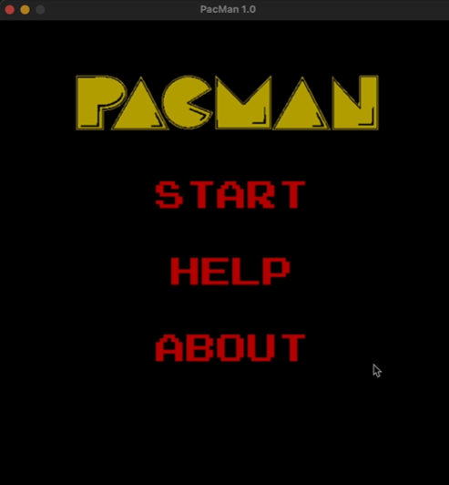
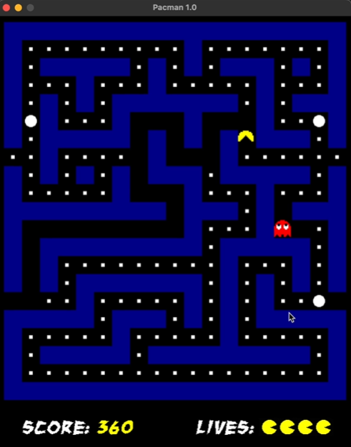
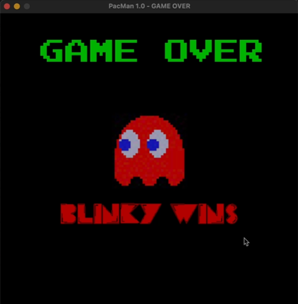

# COPT2a

This is a Imitation of the classic PacMan game, with some alterations to allow multiplayer play.

Created by Tanishq Dubey(2019CS51077) and Aniket Mishra(2019CS50420) as part of the COP290 (2020-21) course.

Instructions for Playing the Game -
1. You will start by seeing the Menu, Choose START to start playing or HELP to see the controls(esc to go back to Menu)
2. You can choose to play as PacMan or Blinky the Ghost
3. PacMan's objective is to eat all the pellets and escape Blinky
4. Blinky's objective is to catch PacMan, till he has no lives left
5. There are 4 Power Pellets in the game, if PacMan eats one, Blinky goes into Scared Mode for a few seconds.
6. In Scared Mode, Blinky can be killed by PacMan - increasing PacMan's lives by one.

Here are some screenshots of the game.

